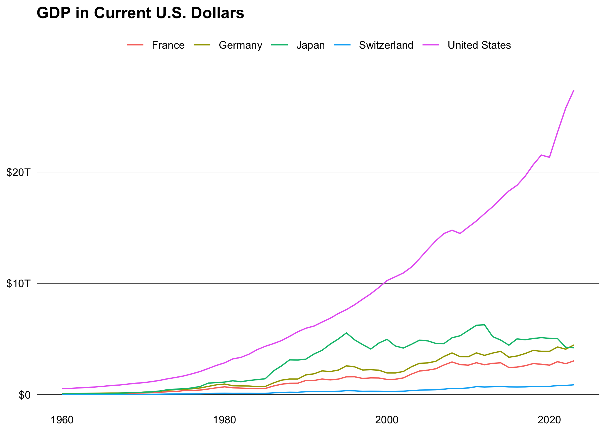

<!-- README.md is generated from README.Rmd. Please edit that file -->

# worldbank

<!-- badges: start -->

[](https://lifecycle.r-lib.org/articles/stages.html#experimental)
[](https://github.com/m-muecke/worldbank/actions/workflows/R-CMD-check.yaml)
[](https://CRAN.R-project.org/package=worldbank)
<!-- badges: end -->

## Overview

worlbank provides a simple interface to the following [World
Bank](https://datahelpdesk.worldbank.org/knowledgebase/articles/889386-developer-information-overview)
APIs:

- [Indicators API
  v2](https://datahelpdesk.worldbank.org/knowledgebase/articles/889392-about-the-indicators-api-documentation)
- [Poverty and Inequality Platform (PIP)
  API](https://pip.worldbank.org/api).
- [Finances One API](https://financesone.worldbank.org)

The main difference to other packages is that it’s a modern
implementation using the [httr2](https://httr2.r-lib.org) package and
supports all available endpoints and parameters.

## Installation

You can install the released version of **worldbank** from
[CRAN](https://CRAN.R-project.org) with:

``` r
install.packages("worldbank")
```

And the development version from [GitHub](https://github.com/) with:

``` r
# install.packages("pak")
pak::pak("m-muecke/worldbank")
```

## Usage

worldbank functions are prefixed with `wb_` and follow the naming
convention of the [World Bank API
v2](https://datahelpdesk.worldbank.org/knowledgebase/articles/889392-about-the-indicators-api-documentation).

``` r
library(worldbank)

# filter by specific country
wb_country(c("US", "DE"))
#>   country_id country_code  country_name region_id region_code
#> 1        DEU           DE       Germany       ECS          Z7
#> 2        USA           US United States       NAC          XU
#>            region_value admin_region_id admin_region_code admin_region_value
#> 1 Europe & Central Asia            <NA>              <NA>               <NA>
#> 2         North America            <NA>              <NA>               <NA>
#>   income_level_id income_level_code income_level_value lending_type_id
#> 1             HIC                XD        High income             LNX
#> 2             HIC                XD        High income             LNX
#>   lending_type_code lending_type_value    capital_city longitude latitude
#> 1                XX     Not classified          Berlin   13.4115  52.5235
#> 2                XX     Not classified Washington D.C.  -77.0320  38.8895

# or fetch all (default)
country <- wb_country()
str(country)
#> 'data.frame':    296 obs. of  18 variables:
#>  $ country_id        : chr  "ABW" "AFE" "AFG" "AFR" ...
#>  $ country_code      : chr  "AW" "ZH" "AF" "A9" ...
#>  $ country_name      : chr  "Aruba" "Africa Eastern and Southern" "Afghanista"..
#>  $ region_id         : chr  "LCN" "NA" "SAS" "NA" ...
#>  $ region_code       : chr  "ZJ" "NA" "8S" "NA" ...
#>  $ region_value      : chr  "Latin America & Caribbean" "Aggregates" "South A"..
#>  $ admin_region_id   : chr  NA NA "SAS" NA ...
#>  $ admin_region_code : chr  NA NA "8S" NA ...
#>  $ admin_region_value: chr  NA NA "South Asia" NA ...
#>  $ income_level_id   : chr  "HIC" "NA" "LIC" "NA" ...
#>  $ income_level_code : chr  "XD" "NA" "XM" "NA" ...
#>  $ income_level_value: chr  "High income" "Aggregates" "Low income" "Aggregat"..
#>  $ lending_type_id   : chr  "LNX" NA "IDX" NA ...
#>  $ lending_type_code : chr  "XX" NA "XI" NA ...
#>  $ lending_type_value: chr  "Not classified" "Aggregates" "IDA" "Aggregates" ...
#>  $ capital_city      : chr  "Oranjestad" NA "Kabul" NA ...
#>  $ longitude         : num  -70 NA 69.2 NA NA ...
#>  $ latitude          : num  12.5 NA 34.5 NA NA ...


# search for specific indicator
ind <- wb_indicator()
ind <- subset(
  ind,
  grepl("GDP", id, fixed = TRUE) & source_value == "World Development Indicators"
)
str(ind)
#> 'data.frame':    37 obs. of  9 variables:
#>  $ id                 : chr  "EG.GDP.PUSE.KO.PP" "EG.GDP.PUSE.KO.PP.KD" "EN.G"..
#>  $ name               : chr  "GDP per unit of energy use (PPP $ per kg of oil"..
#>  $ unit               : chr  NA NA NA NA ...
#>  $ source_id          : int  2 2 2 2 2 2 2 2 2 2 ...
#>  $ source_value       : chr  "World Development Indicators" "World Developmen"..
#>  $ source_note        : chr  "GDP per unit of energy use is the PPP GDP per k"..
#>  $ source_organization: chr  "IEA Statistics © OECD/IEA 2014 (https://www.iea"..
#>  $ topic_id           : int  5 5 6 6 6 6 3 7 3 7 ...
#>  $ topic_value        : chr  "Energy & Mining" "Energy & Mining" "Environment"..

# fetch indicator data for specific or all countries (default)
gdp <- wb_data("NY.GDP.MKTP.CD", c("US", "DE", "FR", "CH", "JP"))
str(gdp)
#> 'data.frame':    320 obs. of  10 variables:
#>  $ date          : int  2023 2022 2021 2020 2019 2018 2017 2016 2015 2014 ...
#>  $ indicator_id  : chr  "NY.GDP.MKTP.CD" "NY.GDP.MKTP.CD" "NY.GDP.MKTP.CD" "N"..
#>  $ indicator_name: chr  "GDP (current US$)" "GDP (current US$)" "GDP (current"..
#>  $ country_id    : chr  "CH" "CH" "CH" "CH" ...
#>  $ country_name  : chr  "Switzerland" "Switzerland" "Switzerland" "Switzerlan"..
#>  $ country_code  : chr  "CHE" "CHE" "CHE" "CHE" ...
#>  $ value         : num  8.85e+11 8.18e+11 8.13e+11 7.42e+11 7.21e+11 ...
#>  $ unit          : chr  NA NA NA NA ...
#>  $ obs_status    : chr  NA NA NA NA ...
#>  $ decimal       : int  0 0 0 0 0 0 0 0 0 0 ...
```



## Related work

- [WDI](https://github.com/vincentarelbundock/WDI): R package to
  download World Bank data
- [pipr](https://github.com/worldbank/pipr): R client for the PIP
  Worldbank API
- [wbstats](https://github.com/gshs-ornl/wbstats): R package for
  searching and downloading data from the World Bank API
- [wbwdi](https://github.com/tidy-intelligence/r-wbwdi): R package to
  download World Bank indicator data
