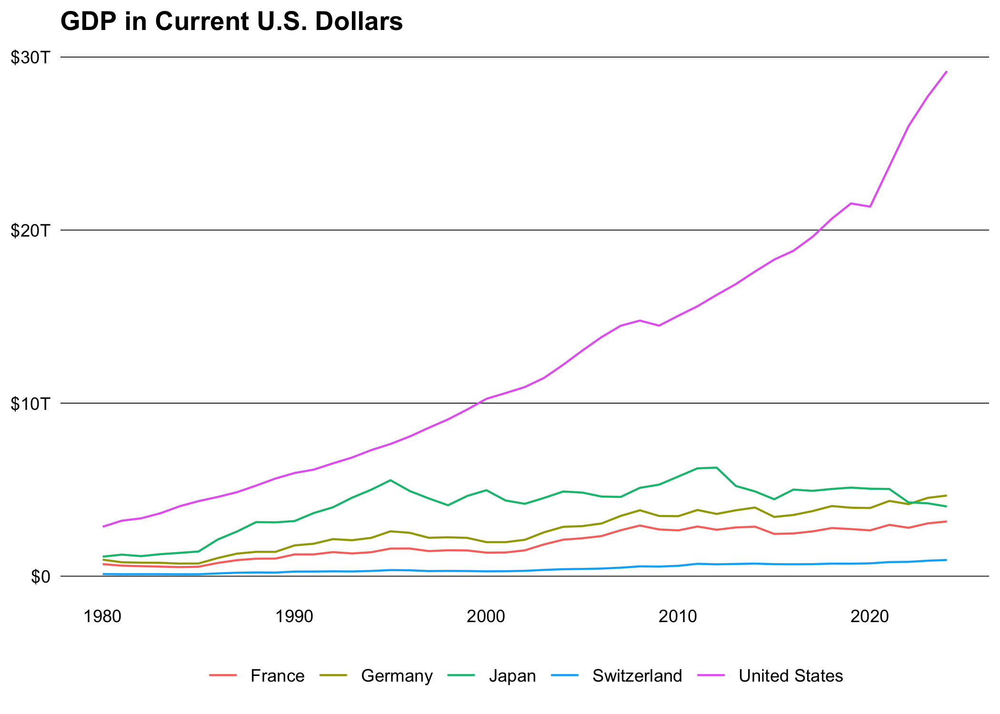

<!-- README.md is generated from README.Rmd. Please edit that file -->

# worldbank

<!-- badges: start -->

[](https://lifecycle.r-lib.org/articles/stages.html#experimental)
[](https://github.com/m-muecke/worldbank/actions/workflows/R-CMD-check.yaml)
[](https://CRAN.R-project.org/package=worldbank)
<!-- badges: end -->

## Overview

**worlbank** provides a simple interface to the following [World
Bank](https://datahelpdesk.worldbank.org/knowledgebase/articles/889386-developer-information-overview)
APIs:

- [Indicators API
  v2](https://datahelpdesk.worldbank.org/knowledgebase/articles/889392-about-the-indicators-api-documentation)
- [Poverty and Inequality Platform (PIP)
  API](https://pip.worldbank.org/api).
- [Finances One API](https://financesone.worldbank.org)

The main difference to other packages is that it’s a modern
implementation using the [httr2](https://httr2.r-lib.org) package and
supports all available endpoints and parameters.

The `worldbank` package provides a set of functions to interact with
various endpoints of the World Bank Indicators API. Each function is
designed to retrieve specific types of data, making it easier to access
and analyze World Bank datasets. Below is an overview of the available
endpoints and their corresponding functions in the package:

- **Languages** (`wb_language`): Retrieves a list of all languages
  supported by the World Bank API. Useful for obtaining
  language-specific data.
- **Lending Types** (`wb_lending_type`): Fetches information about
  different lending types as recognized by the World Bank.
- **Income Levels** (`wb_income_level`): Allows users to access data
  about various income levels defined by the World Bank.
- **Sources** (`wb_source`): Provides details about the different data
  sources available within the World Bank’s datasets.
- **Topics** (`wb_topic`): Lists all topics covered by the World Bank
  API, helping users to narrow down their data search to specific areas
  of interest.
- **Regions** (`wb_region`): Offers information on different
  geographical regions as categorized by the World Bank.
- **Countries** (`wb_country`): Enables access to detailed data about
  individual countries, including socio-economic and developmental
  indicators.
- **Country Indicators** (`wb_country_indicator`): Specific to
  retrieving indicators for a particular country or countries, allowing
  for more targeted data analysis.
- **Indicators** (`wb_indicator`): This endpoint gives users access to a
  wide array of indicators used by the World Bank in its data analysis
  and reports.

## Installation

You can install the released version of **worldbank** from
[CRAN](https://CRAN.R-project.org) with:

``` r
install.packages("worldbank")
```

And the development version from [GitHub](https://github.com/) with:

``` r
# install.packages("pak")
pak::pak("m-muecke/worldbank")
```

## Usage

worldbank functions are prefixed with `wb_` and follow the naming
convention of the [World Bank API
v2](https://datahelpdesk.worldbank.org/knowledgebase/articles/889392-about-the-indicators-api-documentation).

``` r
library(worldbank)

# filter by specific country
wb_country(c("US", "DE"))
#> # A tibble: 2 × 18
#>   country_id country_code country_name  region_id region_code region_value      
#>   <chr>      <chr>        <chr>         <chr>     <chr>       <chr>             
#> 1 DEU        DE           Germany       ECS       Z7          Europe & Central …
#> 2 USA        US           United States NAC       XU          North America     
#> # ℹ 12 more variables: admin_region_id <chr>, admin_region_code <chr>,
#> #   admin_region_value <chr>, income_level_id <chr>, income_level_code <chr>,
#> #   income_level_value <chr>, lending_type_id <chr>, lending_type_code <chr>,
#> #   lending_type_value <chr>, capital_city <chr>, longitude <dbl>,
#> #   latitude <dbl>

# or fetch all (default)
wb_country()
#> # A tibble: 296 × 18
#>   country_id country_code country_name        region_id region_code region_value
#>   <chr>      <chr>        <chr>               <chr>     <chr>       <chr>       
#> 1 ABW        AW           Aruba               LCN       ZJ          Latin Ameri…
#> 2 AFE        ZH           Africa Eastern and… NA        NA          Aggregates  
#> 3 AFG        AF           Afghanistan         SAS       8S          South Asia  
#> 4 AFR        A9           Africa              NA        NA          Aggregates  
#> 5 AFW        ZI           Africa Western and… NA        NA          Aggregates  
#> # ℹ 291 more rows
#> # ℹ 12 more variables: admin_region_id <chr>, admin_region_code <chr>,
#> #   admin_region_value <chr>, income_level_id <chr>, income_level_code <chr>,
#> #   income_level_value <chr>, lending_type_id <chr>, lending_type_code <chr>,
#> #   lending_type_value <chr>, capital_city <chr>, longitude <dbl>,
#> #   latitude <dbl>

# search for specific indicator
ind <- wb_indicator()
ind <- subset(
  ind,
  grepl("GDP", id, fixed = TRUE) & source_value == "World Development Indicators"
)
ind
#> # A tibble: 35 × 9
#>   id          name  unit  source_id source_value source_note source_organization
#>   <chr>       <chr> <chr> <chr>     <chr>        <chr>       <chr>              
#> 1 EG.GDP.PUS… GDP … <NA>  2         World Devel… GDP per un… IEA Statistics © O…
#> 2 EG.GDP.PUS… GDP … <NA>  2         World Devel… GDP per un… IEA Statistics © O…
#> 3 ER.GDP.FWT… Wate… <NA>  2         World Devel… Water prod… Food and Agricultu…
#> 4 NY.GDP.COA… Coal… <NA>  2         World Devel… Coal rents… World Bank staff e…
#> 5 NY.GDP.DEF… Infl… <NA>  2         World Devel… Inflation … World Bank nationa…
#> # ℹ 30 more rows
#> # ℹ 2 more variables: topic_id <chr>, topic_value <chr>

# fetch indicator data for specific or all countries (default)
gdp <- wb_country_indicator("NY.GDP.MKTP.CD", c("US", "DE", "FR", "CH", "JP"))
gdp
#> # A tibble: 320 × 10
#>    date indicator_id indicator_name country_id country_name country_code   value
#>   <int> <chr>        <chr>          <chr>      <chr>        <chr>          <dbl>
#> 1  2023 NY.GDP.MKTP… GDP (current … CH         Switzerland  CHE          8.85e11
#> 2  2022 NY.GDP.MKTP… GDP (current … CH         Switzerland  CHE          8.18e11
#> 3  2021 NY.GDP.MKTP… GDP (current … CH         Switzerland  CHE          8.13e11
#> 4  2020 NY.GDP.MKTP… GDP (current … CH         Switzerland  CHE          7.42e11
#> 5  2019 NY.GDP.MKTP… GDP (current … CH         Switzerland  CHE          7.21e11
#> # ℹ 315 more rows
#> # ℹ 3 more variables: unit <chr>, obs_status <chr>, decimal <int>
```



## Related work

- [wbstats](https://github.com/gshs-ornl/wbstats): R package for
  searching and downloading data from the World Bank API
- [WDI](https://github.com/vincentarelbundock/WDI): R package to
  download World Bank data
- [pipr](https://github.com/worldbank/pipr): R client for the PIP
  Worldbank API
